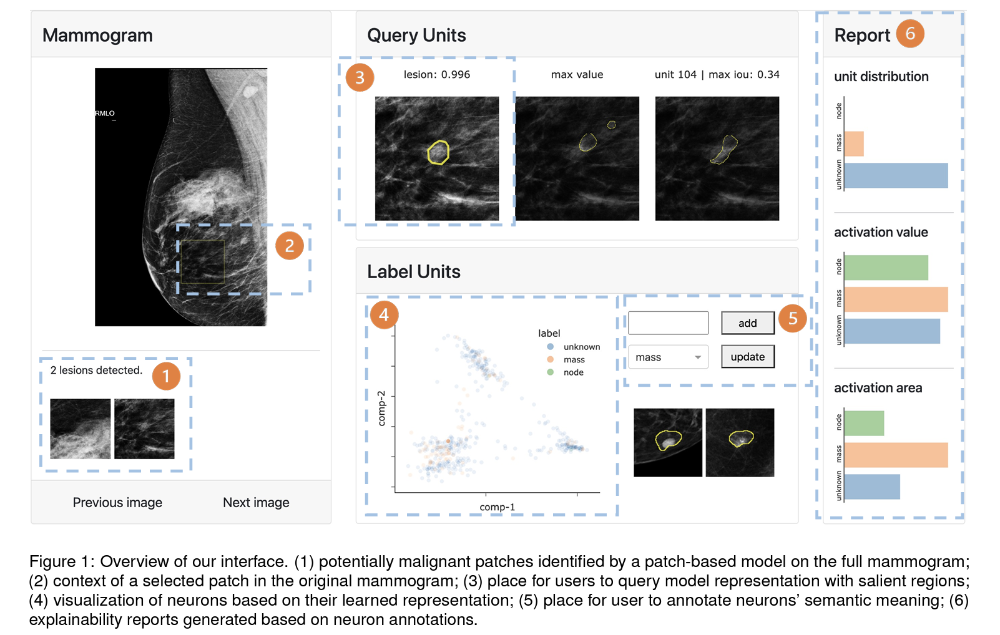
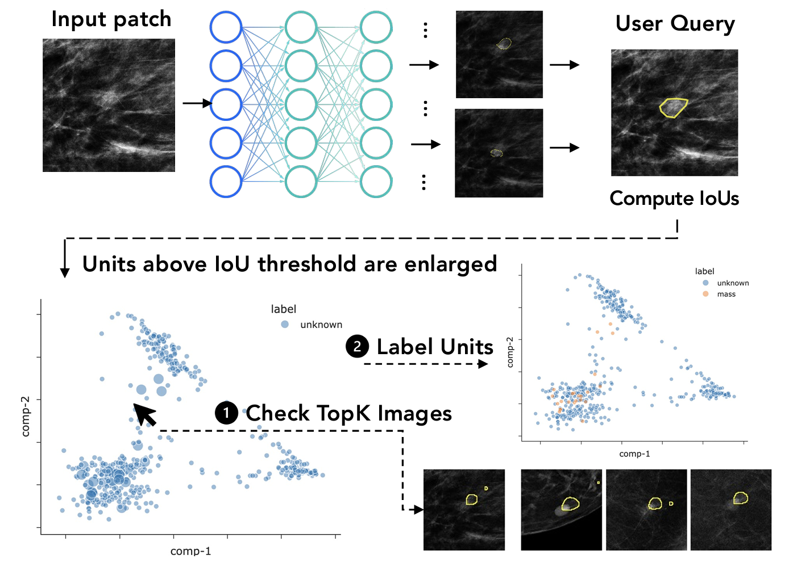

# An Interactive Interpretability System for Breast Cancer Screening with Deep Learning.

This repo provides the implementation of the paper titled above. This system assists radiologists in probing and understanding the decisions of a neural network that screens breast cancer by inspecting the semantics of individual neurons. 



Moreover, this interface allows radiologits to incorporate domain knowledge to these neurons in a scalable way. These neurons could then more detailed explantaions of neural network' decisions. 




This system is implemented via Plotly Dash. 

## Citation
> Lu, Y., & Perer, A. (2022). An Interactive Interpretability System for Breast Cancer Screening with Deep Learning. IEEE Visualization Conference Workshop on Visualization in Biomedical AI.

```
@article{lu2022interactive,
  title={An Interactive Interpretability System for Breast Cancer Screening with Deep Learning},
  author={Lu, Yuzhe and Perer, Adam},
  journal={arXiv preprint arXiv:2210.08979},
  year={2022}
}
```

## Download data
[Link](https://drive.google.com/drive/folders/1u6cpF0S-rOu1SaLrl0jQdZKyleN7l0ZK?usp=sharing)

After downloading, put all folders in the same level as ```dash_app``` as the following

```bash
- ckpt
- data
- json
- patch_data
```

Then, go to ```dash_app``` and follow the instructions in ```README.md``` to run the app locally
